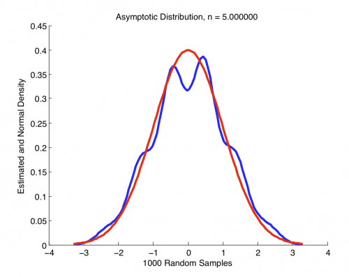
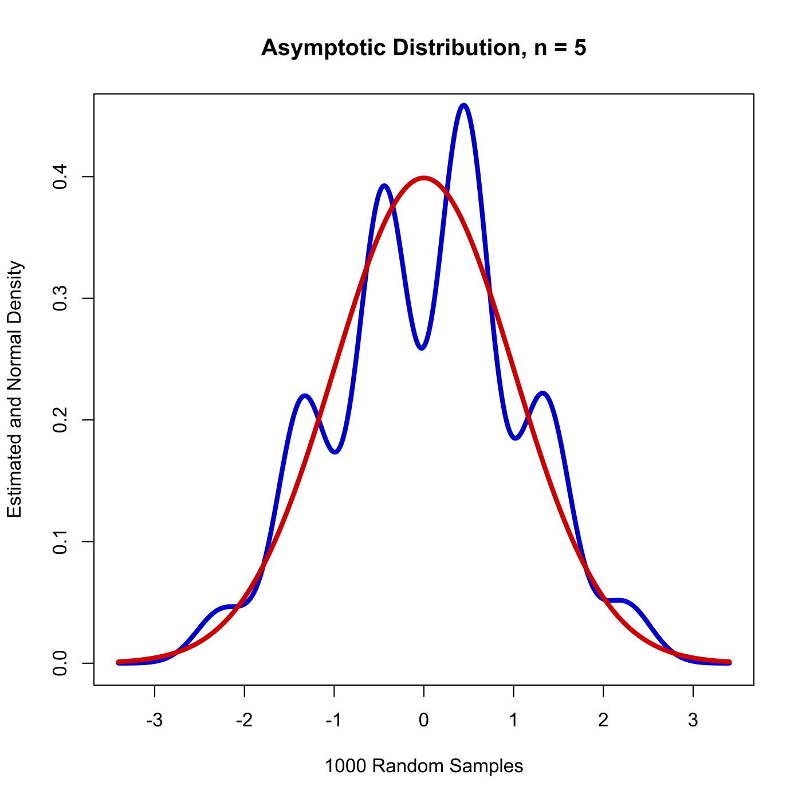
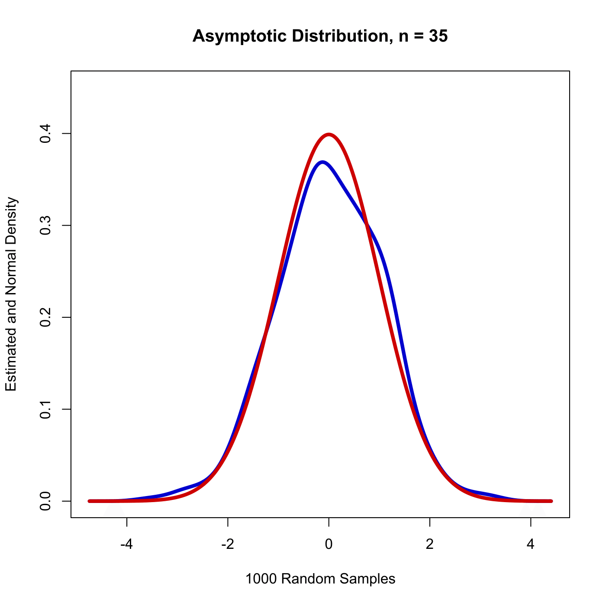

[](http://quantlet.de/)

## [](http://quantlet.de/) **MVAcltbern** [](http://quantlet.de/)

```yaml

Name of QuantLet: MVAcltbern

Published in: Applied Multivariate Statistical Analysis

Description: Illustrates the (univariate) Central Limit Theorem (CLT). n*1000 sets of n-dimensional Bernoulli samples are generated and used to approximate the distribution of t = sqrt(n)*(mean(x)-mu)/sigma -> N(0,1). The estimated density (blue) of t is shown together with the standard normal (red).

Keywords: plot, graphical representation, bernoulli, normal, CLT, density, distribution, standard-normal, asymptotic

See also: MVAgausscauchy, MVAcltbern2, MVAcauchy, MVAtdis

Author: Wolfgang K. Haerdle

Submitted: Wed, December 07 2011 by Dedy Dwi Prastyo
Submitted[Matlab]: Tue, November 22 2016 by Lily Medina

Example: 
- 1: n=5
- 2: n=35

```








### MATLAB Code
```matlab

%% clear all variable
clear all
close all
clc

%% set input
p = 0.5;
n = 5; % vary n = 35; n = 5

bsamplem = binornd(1, 0.5,n,1000);                       %Random generation of the binomial distribution with parameters 1000*n and 0.5
[bden xi] = ksdensity((mean(bsamplem) - p)/sqrt(p*(1-p)/n));  %Compute kernel density estimate

%% plot
hold on
plot(xi,bden,'b','Linewidth',2.5)
xlabel('1000 Random Samples') 
ylabel('Estimated and Normal Density')
ylim([0, 0.45]) %Plot kernel density

plot(xi, normpdf(xi), 'r', 'Linewidth',2.5) %Plot normal density
hold off
str = sprintf('Asymptotic Distribution, n = %f ',n);
title(str)

```

automatically created on 2018-05-28

### R Code
```r


# clear all variables
rm(list = ls(all = TRUE))
graphics.off()

# install and load packages
libraries = c("KernSmooth")
lapply(libraries, function(x) if (!(x %in% installed.packages())) {
    install.packages(x)
})
lapply(libraries, library, quietly = TRUE, character.only = TRUE)

p = 0.5
n = 35
bsample  = rbinom(n * 1000, 1, 0.5)       # Random generation of the binomial distribution with parameters 1000*n and 0.5
bsamplem = matrix(bsample, n, 1000)       # Create a matrix of binomial random variables
bden     = bkde((colMeans(bsamplem) - p)/sqrt(p * (1 - p)/n))  # Compute kernel density estimate

# Plot
plot(bden, col = "blue3", type = "l", lty = 1, lwd = 4, xlab = "1000 Random Samples", 
    ylab = "Estimated and Normal Density", cex.lab = 1, cex.axis = 1, ylim = c(0, 
        0.45))
lines(bden$x, dnorm(bden$x), col = "red3", lty = 1, lwd = 4)  
title(paste("Asymptotic Distribution, n =", n)) 

```

automatically created on 2018-05-28