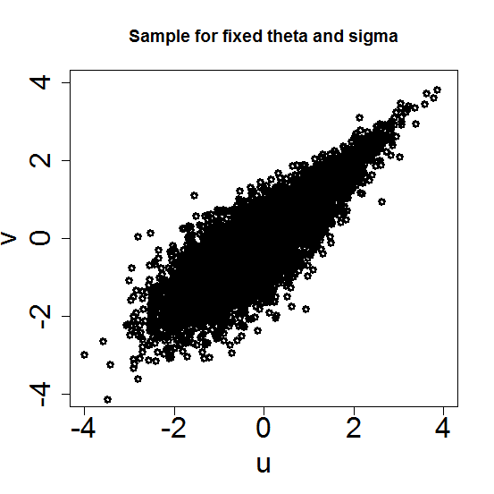
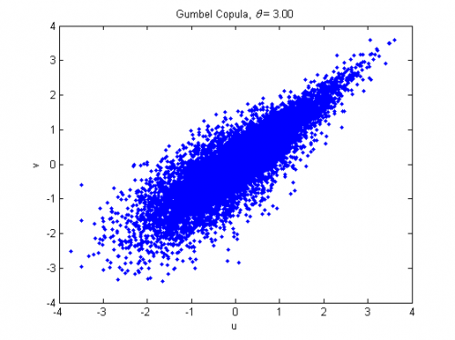

[](http://quantlet.de/)

## [](http://quantlet.de/) **MVAsample1000** [](http://quantlet.de/)

```yaml

Name of Quantlet: MVAsample1000

Published in: Applied Multivariate Statistical Analysis

Description: Produces Gumbel-Hougaard copula sampling for fixed parameters sigma and theta.

Keywords: copula, gumbel, scatterplot, plot, data visualization, graphical representation 

See also: MVAcontnorm, MVAghcontour, MVAtdis

Author: Song Song

Submitted: Fri, August 05 2011 by Awdesch Melzer
Submitted[Matlab]: Thu, November 24 2016 by Lily Medina

Example: 10000-sample output for sigma_1 = 1, sigma_2 = 1, theta = 3.

```





### MATLAB Code
```matlab

%% clear variables and close windows
clear all
close all
clc

%% set input
theta = 3;
n     = 10000;
U     = copularnd('Gumbel',theta,n);
mu    = 0; %mean
s     = 1;  %std
yx    = erfinv(2*U-1).*sqrt(2).*s + mu;

%% plot
plot(yx(:,1),yx(:,2),'.')
title(['Gumbel Copula, {ittheta} = ',sprintf('%0.2f',theta)])
xlabel('u')
ylabel('v')
xlim([-4,4])
ylim([-4,4])

```

automatically created on 2018-05-28

### R Code
```r


# clear all variables
rm(list = ls(all = TRUE))
graphics.off()

rAC = function(name, n, d, theta) {
    illegalpar = switch(name, clayton = (theta < 0), gumbel = (theta < 1), frank = (theta < 
        0), BB9 = ((theta[1] < 1) | (theta[2] < 0)), GIG = ((theta[2] < 0) | (theta[3] < 
        0) | ((theta[1] > 0) & (theta[3] == 0)) | ((theta[1] < 0) & (theta[2] == 
        0))))
    if (illegalpar) 
        stop("Illegal parameter value")
    independence = switch(name, clayton = (theta == 0), gumbel = (theta == 1), frank = (theta == 
        0), BB9 = (theta[1] == 1), GIG = FALSE)
    U = runif(n * d)
    U = matrix(U, nrow = n, ncol = d)
    if (independence) 
        return(U)
    Y = switch(name, clayton = rgamma(n, 1/theta), gumbel = rstable(n, 1/theta) * 
        (cos(pi/(2 * theta)))^theta, frank = rFrankMix(n, theta), BB9 = rBB9Mix(n, 
        theta), GIG = rGIG(n, theta[1], theta[2], theta[3]))
    Y = matrix(Y, nrow = n, ncol = d)
    phi.inverse = switch(name, clayton = function(t, theta) {
        (1 + t)^(-1/theta)
    }, gumbel = function(t, theta) {
        exp(-t^(1/theta))
    }, frank = function(t, theta) {
        (-1/theta) * log(1 - (1 - exp(-theta)) * exp(-t))
    }, BB9 = function(t, theta) {
        exp(-(theta[2]^theta[1] + t)^(1/theta[1]) + theta[2])
    }, GIG = function(t, theta) {
        lambda = theta[1]
        chi = theta[2]
        psi = theta[3]
        if (chi == 0) out = (1 + 2 * t/psi)^(-lambda) else if (psi == 0) out = 2^(lambda + 
            1) * exp(besselM3(lambda, sqrt(2 * chi * t), logvalue = TRUE) - lambda * 
            log(2 * chi * t)/2)/gamma(-lambda) else out = exp(besselM3(lambda, sqrt(chi * 
            (psi + 2 * t)), logvalue = TRUE) + lambda * log(chi * psi)/2 - besselM3(lambda, 
            sqrt(chi * psi), logvalue = TRUE) - lambda * log(chi * (psi + 2 * t))/2)
        out
    })
    phi.inverse(-log(U)/Y, theta)
}

rstable = function(n, alpha, beta = 1) {
    t0 = atan(beta * tan((pi * alpha)/2))/alpha
    Theta = pi * (runif(n) - 0.5)
    W = -log(runif(n))
    term1 = sin(alpha * (t0 + Theta))/(cos(alpha * t0) * cos(Theta))^(1/alpha)
    term2 = ((cos(alpha * t0 + (alpha - 1) * Theta))/W)^((1 - alpha)/alpha)
    term1 * term2
}

# special call to rAC for backwards compatibility
rcopula.gumbel = function(n, theta, d) {
    rAC("gumbel", n, d, theta)
}
sample.gc = rcopula.gumbel(10000, theta = 3, d = 2)

# using qnorm to apply sigma = 1
sample.metagc = apply(sample.gc, 2, qnorm)

# plot
plot(sample.metagc, xlim = c(-4, 4), ylim = c(-4, 4), xlab = "u", ylab = "v", lwd = 3, 
    cex.axis = 2, cex.lab = 2)
title("Sample for fixed theta and sigma")

```

automatically created on 2018-05-28