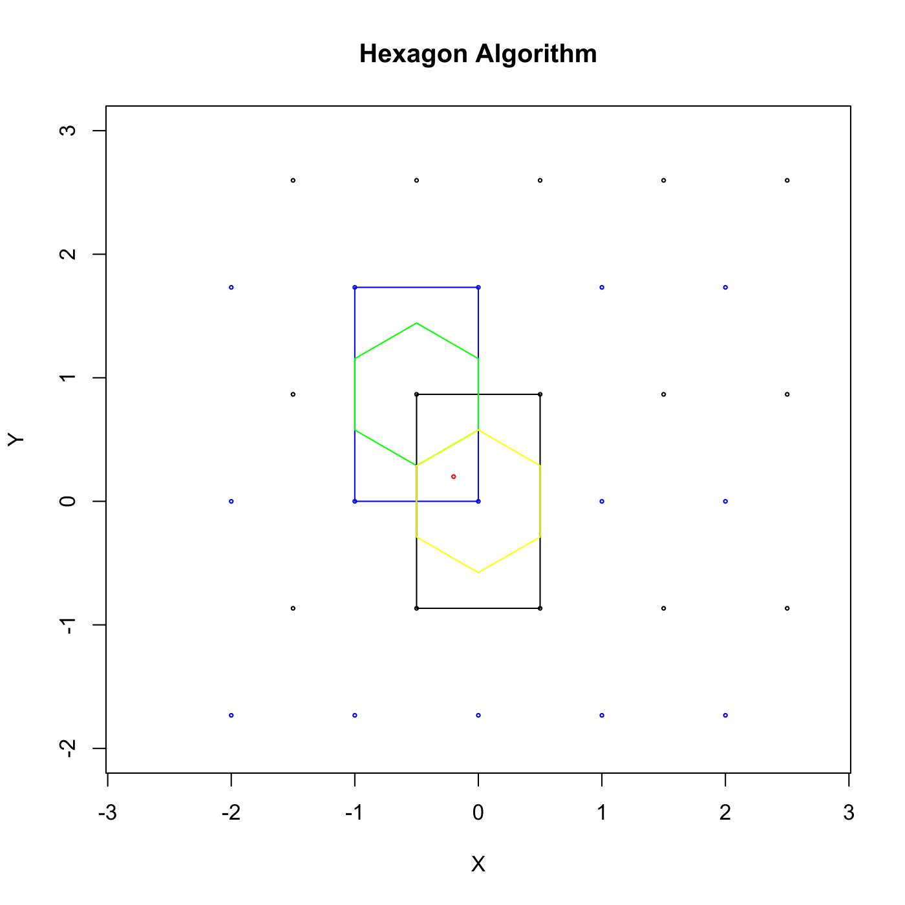
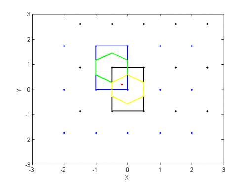

[](http://quantlet.de/)

## [](http://quantlet.de/) **MVAhexaAl** [](http://quantlet.de/)

```yaml

Name of QuantLet: MVAhexaAl

Published in: Applied Multivariate Statistical Analysis

Description: Plot of hexagon algorithm.

Keywords: plot, graphical representation, hexagon-plot, sas

See also: MVAageCom, MVAageIncome, MVAincomeLi, SMSscanorm2

Author: Vinh Hanh Lieu
Author[SAS]: Svetlana Bykovskaya

Submitted: Tue, September 09 2014 by Awdesch Melzer
Submitted[SAS]: Wen, April 6 2016 by Svetlana Bykovskaya
Submitted[Matlab]: Tue, November 22 2016 by Lily Medina

Example: User inputs a, b, blue, black to draw the blue, black points and red for the red point. The first point in the blue line is (-2, -1,732) One can give different coordinates for input parameters according to formula of hexagon. By giving coordinates one can make rectangle or hexagon with function polygon.

```






### R Code
```r


# clear variables and close windows
rm(list = ls(all = TRUE))
graphics.off()

# create blue and black points
a = c(-sqrt(3), 0, sqrt(3))
blue = rep(-2:2, each = length(a))
b = c(-sqrt(3)/2, sqrt(3)/2, 3 * sqrt(3)/2)

black = rep(-1.5:2.5, each = length(b))
point1 = rep(a, length(blue)/length(a))
point2 = rep(b, length(black)/length(b))
red = c(-0.2, 0.2)

co1 = sqrt(3)/2 - 1/sqrt(3)
co2 = sqrt(3)/2 - 1/(2 * sqrt(3))
co3 = sqrt(3)/2 + 1/(2 * sqrt(3))
co4 = sqrt(3)/2 + 1/sqrt(3)
co5 = -1/sqrt(3)
co6 = -1/(2 * sqrt(3))

# plot
plot(xy.coords(blue, point1), main = "Hexagon Algorithm", col = "blue", xlab = "X", ylab = "Y", xlim = c(-2, 
    2), ylim = c(-2, 3), asp = 1, cex = 0.35)

points(xy.coords(black, point2), col = "black", xlim = c(-2, 2), ylim = c(-3, 3), 
    asp = 1, cex = 0.35)

# create a red point
points(xy.coords(-0.2, 0.2), col = "red", xlim = c(-2, 2), ylim = c(-3, 3), asp = 1, 
    cex = 0.35)

# creat blue rectangle
polygon(c(-1, -1, 0, 0), c(0, sqrt(3), sqrt(3), 0), border = "blue", xlim = c(-2, 
    2), ylim = c(-3, 3), asp = 1, cex = 0.35)

# creat black rectangle
polygon(c(-0.5, -0.5, 0.5, 0.5), c(-sqrt(3)/2, sqrt(3)/2, sqrt(3)/2, -sqrt(3)/2), 
    xlim = c(-2, 2), ylim = c(-3, 3), asp = 1, cex = 0.35)

# creat green hexagon
polygon(c(-0.5, -1, -1, -0.5, 0, 0), c(co1, co2, co3, co4, co3, co2), border = "green", 
    xlim = c(-2, 2), ylim = c(-3, 3), asp = 1, cex = 0.35)

# creat yellow hexagon
polygon(c(0, -0.5, -0.5, 0, 0.5, 0.5), c(co5, co6, co1, co2, co1, co6), border = "yellow", 
    xlim = c(-2, 2), ylim = c(-3, 3), asp = 1, cex = 0.35)

```

automatically created on 2018-05-28

### MATLAB Code
```matlab

%% clear all variables
clear all
close all
clc

%% create blue and black points
a    = [-sqrt(3),0,sqrt(3)]';
blue = [-2,-2,-2,-1,-1,-1,0,0,0,1,1,1,2,2,2]';
b    =  [-sqrt(3)/2, sqrt(3)/2, 3*sqrt(3)/2]';

black   =  [-1.5,-1.5,-1.5,-0.5,-0.5,-0.5,0.5,0.5,0.5,1.5,1.5,1.5,2.5,2.5,2.5]';
point1  =  repmat(a,length(blue)/length(a),1);
point2  =  repmat(b,length(black)/length(b),1);
red     = [-0.2,0.2]';

co1 =  sqrt(3)/2-1/sqrt(3);
co2 =  sqrt(3)/2-1/(2*sqrt(3));
co3 =  sqrt(3)/2+1/(2*sqrt(3));
co4 =  sqrt(3)/2+1/sqrt(3);
co5 =  -1/sqrt(3);
co6 =  -1/(2*sqrt(3)) ;

%% plot
figure(1)
hold on
box on
plot(blue, point1,'b.')
xlabel('X')
ylabel('Y') 
xlim([-3,3]),ylim([-3,3])
plot(black, point2,'k.')
plot(-0.2,0.2,'r.') % create a red point
plot([-1,-1,0,0,-1],[0,sqrt(3),sqrt(3),0,0],'b-','LineWidth',2) % creat blue rectangle
plot([-0.5,-0.5,0.5,0.5,-0.5],[-sqrt(3)/2,sqrt(3)/2,sqrt(3)/2,-sqrt(3)/2,-sqrt(3)/2],'k-','LineWidth',2) % creat black rectangle
plot([-0.5,-1,-1,-0.5,0,0,-0.5],[co1,co2,co3,co4,co3,co2,co1],'g-','LineWidth',2)% creat green hexagon
plot([0,-0.5,-0.5,0,0.5,0.5,0],[co5,co6,co1,co2,co1,co6,co5],'y-','LineWidth',2) % creat yellow hexagon
hold off

```

automatically created on 2018-05-28

### SAS Code
```sas

proc iml;
  * create vector;
  start RepV(a,c);
    do i = 1 to ncol(c);
      res = res || repeat(c[i], 1, ncol(a));
    end;
  return(res);
  finish;
  
  * create blue and black points;
  a = (-sqrt(3)) || {0} || sqrt(3);
  blue = RepV(a,-2:2);
  b = (-sqrt(3)/2) || (sqrt(3)/2) || (3 * sqrt(3)/2);
  black = RepV(b,-1.5:2.5);
  point1 = repeat(a, 1, ncol(blue)/ncol(a));
  point2 = repeat(b, 1, ncol(black)/ncol(b));
  red1 = -0.2;
  red2 = 0.2;
  
  co1 = sqrt(3)/2 - 1/sqrt(3);
  co2 = sqrt(3)/2 - 1/(2 * sqrt(3));
  co3 = sqrt(3)/2 + 1/(2 * sqrt(3));
  co4 = sqrt(3)/2 + 1/sqrt(3);
  co5 = -1/sqrt(3);
  co6 = -1/(2 * sqrt(3));
  
  * coordinates of blue rectangle, black rectangle, 
  green hexagon and yellow hexagon;
  rec1 = {-1,   -1,    0,    0, 
        -0.5, -0.5,  0.5,  0.5, 
        -0.5,   -1,   -1, -0.5,   0,   0, 
           0, -0.5, -0.5,    0, 0.5, 0.5}`;
  rec2 = {0}     || sqrt(3)   || sqrt(3)   || {0}          ||
    (-sqrt(3)/2) || sqrt(3)/2 || sqrt(3)/2 || (-sqrt(3)/2) ||
    co1 || co2 || co3 || co4 || co3 || co2 ||
    co5 || co6 || co1 || co2 || co1 || co6;
  id = repeat({1}, 1, 4) || repeat({2}, 1, 4) || 
       repeat({3}, 1, 6) || repeat({4}, 1, 6);

  create plot var {"blue" "black" "red1" "red2" "point1" "point2"
    "rec1" "rec2" "id"};
    append;
  close plot;
quit;

proc sgplot data = plot
    noautolegend;
  title 'Hexagon Algorithm';
  scatter x = blue  y = point1 / markerattrs = (color = blue);
  scatter x = black y = point2 / markerattrs = (color = black);
  scatter x = red1 y = red2 / markerattrs = (color = red);
  polygon x = rec1 y = rec2 id = id / 
    colorresponse = id colormodel = (blue black green yellow)
    lineattrs = (thickness = 2);
  xaxis min = -2 max = 2 label = 'X';
  yaxis min = -2 max = 3 label = 'Y';
run;

```

automatically created on 2018-05-28