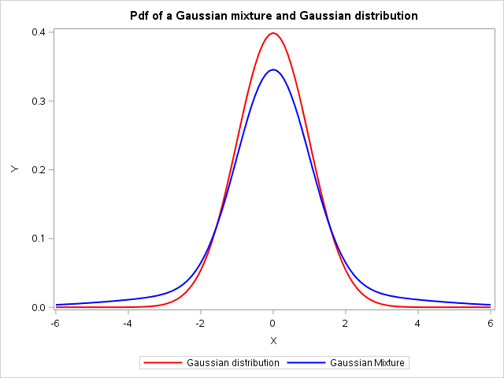
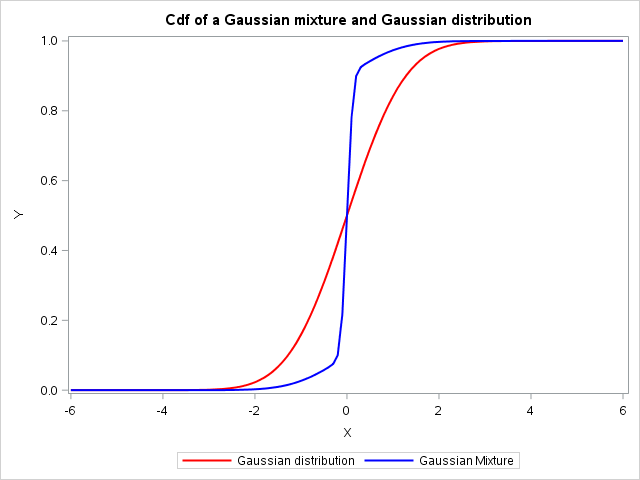
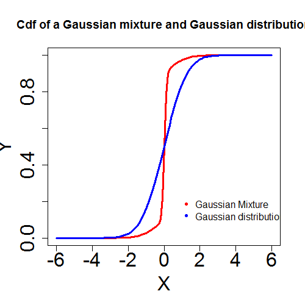

[](http://quantlet.de/)

## [](http://quantlet.de/) **MVAmixture** [](http://quantlet.de/)

```yaml

Name of QuantLet: MVAmixture

Published in: Applied Multivariate Statistical Analysis

Description: Plots probability density functions and cumulative density functions of Gaussian mixture and Gaussian distributions.

Keywords: gaussian, plot, graphical representation, distribution, pdf, cdf, probability, density, multivariate, heavy-tailed, sas

Author: Wolfgang K. Haerdle
Author[SAS]: Svetlana Bykovskaya

Submitted: Thu, February 02 2012 by Dedy Dwi Prastyo
Submitted[SAS]: Wen, April 6 2016 by Svetlana Bykovskaya
Submitted[Matlab]: Wed, November 23 2016 by Lily Medina

```









### MATLAB Code
```matlab

%% Clear variables and close windows
clear all
close all
clc

%% set input
%Gaussian Mixture and Gaussian distribution

x = -6:0.01:6;

gaussmixpdf = 1./(5*(2*pi).^(1/2))*(4*exp(-x.^2/2)+1/3*exp(-x.^2/18));
gaussmixcdf = 0.8*normcdf(x,0,0.1)+0.2*normcdf(x,0,0.9);

gausspdf = normpdf(x);
gausscdf = normcdf(x);

%% Plot of Gaussian and Gaussian mixture distributions
subplot(1,2,1)
hold on
box on
plot(x, gaussmixpdf, 'Color','b','Linewidth',2.5)
plot(x, gausspdf, 'Color','r','Linewidth',2.5)
xlabel('X')
ylabel('Y')
ylim([0,0.42])
xlim([-6,6])
title('PDF of a Gaussian mixture and Gaussian')
legend('Gaussian mixture','Gaussian','Location','SouthOutside')
hold off

subplot(1,2,2)
hold on
box on
plot(x, gaussmixcdf, 'Color','b','Linewidth',2.5)
plot(x, gausscdf, 'Color','r','Linewidth',2.5)
xlabel('X')
ylabel('Y')
ylim([0,1])
xlim([-6,6])
title('CDF of a Gaussian mixture and Gaussian')
legend('Gaussian mixture','Gaussian','Location','SouthOutside')
hold off

```

automatically created on 2018-05-28

### R Code
```r


# clear variables and close windows
rm(list = ls(all = TRUE))
graphics.off()

# Gaussian Mixture and Gaussian distribution
gaussian = function(x, y) {
    y = 1/(5 * (2 * pi)^(1/2)) * (4 * exp(-x^2/2) + 1/3 * exp(-x^2/18))
    return(y)
}
xx = seq(-6, 6, by = 0.1)

# Plot of Gaussian PDF
plot(xx, gaussian(xx), type = "l", col = "blue", ylim = c(0, 0.4), ylab = "Y", xlab = "X", 
    lwd = 3, cex.lab = 2, cex.axis = 2)
lines(seq(-5, 5, 0.01), dnorm(seq(-5, 5, 0.01)), type = "l", col = "red", lwd = 3)
legend(x = 0.75, y = 0.25, legend = c("Gaussian Mixture", "Gaussian distribution"), 
    pch = c(20, 20), col = c("blue", "red"), bty = "n")
title("Pdf of a Gaussian mixture and Gaussian distribution")

xx = seq(-6, 6, by = 0.1)
gaussian = function(x, y) {
    y = 0.8 * pnorm(xx, mean = 0, sd = 0.1) + 0.2 * pnorm(xx, mean = 0, sd = 0.9)
    return(y)
}

# Plot of Gaussian CDF
dev.new()
plot(xx, gaussian(xx), type = "l", col = "red", ylim = c(0, 1), ylab = "Y", xlab = "X", 
    cex.lab = 2, cex.axis = 2, lwd = 3)
lines(xx, pnorm(xx, mean = 0, sd = 1), type = "l", col = "blue", lwd = 3)
legend(x = 0.75, y = 0.25, legend = c("Gaussian Mixture", "Gaussian distribution"), 
    pch = c(20, 20), col = c("red", "blue"), bty = "n")

title("Cdf of a Gaussian mixture and Gaussian distribution") 

```

automatically created on 2018-05-28

### SAS Code
```sas

data pdf;
  pi = constant("pi");
  do x = -6 to 6 by 0.1;
    p1 = pdf("Normal", x);
    p2 = 1/(5 * (2 * pi) ** (1/2)) * (4 * exp(-x ** 2/2) + 1/3 * exp(-x ** 2/18));
    c1 = cdf("Normal", x);
    c2 = 0.8 * cdf("Normal", x, 0, 0.1) + 0.2 * cdf("Normal", x, 0, 0.9);
    output;
  end;
run;
 
* Plot of Gaussian PDF;
proc sgplot data = pdf;
  title 'Pdf of a Gaussian mixture and Gaussian distribution';
  series x = x y = p1 / legendlabel = 'Gaussian distribution' lineattrs = (color = red thickness = 2);
  series x = x y = p2 / legendlabel = 'Gaussian Mixture' lineattrs = (color = blue thickness = 2);
  xaxis label = "X"; 
  yaxis min = 0 max = 0.4 label = "Y";
run;

* Plot of Gaussian CDF;
proc sgplot data = pdf;
  title 'Cdf of a Gaussian mixture and Gaussian distribution';
  series x = x y = c1 / legendlabel = 'Gaussian distribution' lineattrs = (color = red thickness = 2);
  series x = x y = c2 / legendlabel = 'Gaussian Mixture' lineattrs = (color = blue thickness = 2);
  xaxis label = "X"; 
  yaxis min = 0 max = 1 label = "Y";
run;
```

automatically created on 2018-05-28