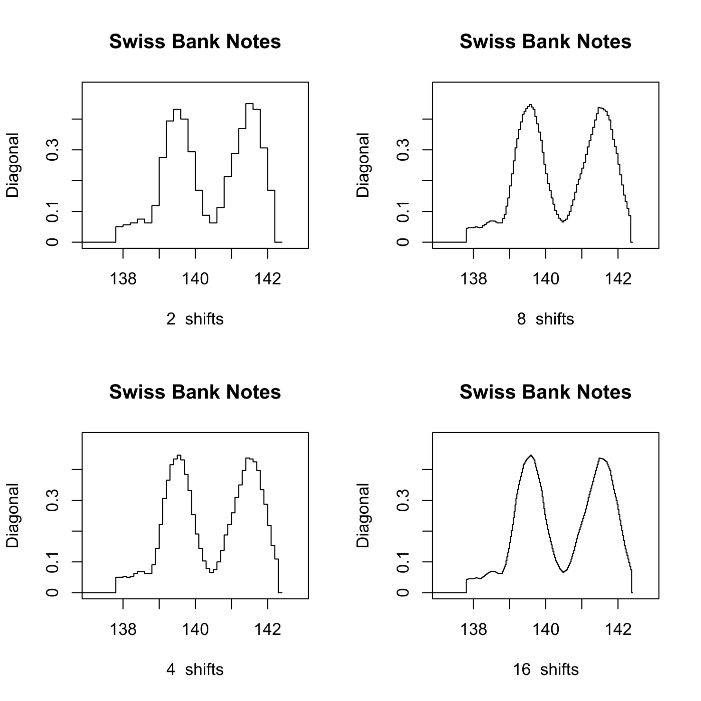
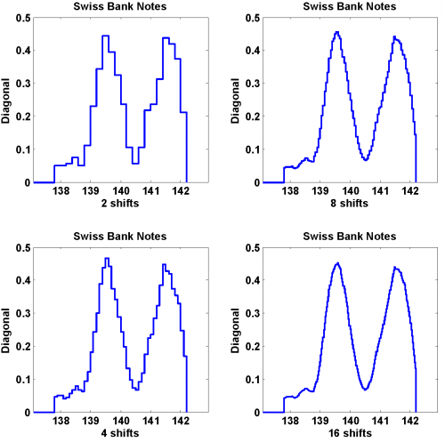

[](http://quantlet.de/)

## [](http://quantlet.de/) **MVAashbank** [](http://quantlet.de/)

```yaml

Name of QuantLet: MVAashbank

Published in: Applied Multivariate Statistical Analysis

Description: Computes the averaged shifted histogram for the diagonal of all Swiss bank notes.

Keywords: data visualization, graphical representation, plot, histogram, financial

See also: MVAandcur, MVAandcur2, MVAhisbank1, MVAhisbank2

Author: Till Grossmass, Jorge Patron, Vladimir Georgescu, Song Song

Submitted: Mon, September 15 2014 by Awdesch Melzer
Submitted[Matlab]: Mon, November 14 2016 by Lily Medina

Datafiles: bank2.dat

```





### R Code
```r


# clear variables and close windows
rm(list = ls(all = TRUE))
graphics.off()

# load data
x = read.table("bank2.dat")
x = x[, 6]  # Only consider the diagonal

n = length(x)  # Number of observations.
step = c(2, 8, 4, 16)  # Define the number of shifts.

t0 = NULL
tf = NULL

for (l in 1:4) {
    h = 0.4
    t0 = h * (floor(min(x)/h) + 0.5)  # Min
    tf = h * (floor(max(x)/h) - 0.5)  # Max
    
    m = step[l]
    delta = h/m
    
    nbin = floor((max(x) - min(x))/delta)
    binedge = seq(min(x), max(x), delta)  # Define the bins of the histogram
    
    # ex=x[x<=142.2] vk = plot(apply(x,1,sort),type='l')
    
    vk = hist(x, binedge, plot = FALSE)$counts  # Count the number of elements in each bin
    fhat = c(rep(0, m - 1), vk, rep(0, m - 1))
    
    kern = function(s) 1 - abs(s)
    ind = (1 - m):(m - 1)
    den = sum(kern(ind/m))
    wm = m * (kern(ind/m))/den
    
    fhatk = matrix(0, 0, n + 1)
    
    for (k in 1:nbin) {
        ind = k:(2 * m + k - 2)
        fhatk[k] = sum(wm * fhat[ind])
    }
    
    fhatk = fhatk/(n * h)
    binedge = c(rep(0, 1), binedge)
    fhatk = c(rep(0, 1), fhatk, rep(0, 2))
    
    # Plot the different histograms
    split.screen(c(2, 2))
    screen(l)
    plot(binedge, fhatk, type = "s", ylim = c(0, 0.5), xlim = c(137.1, 142.9), 
        main = "Swiss Bank Notes", xlab = paste(step[l], " shifts"), ylab = "Diagonal", 
        axes = FALSE, frame = TRUE)
    axis(side = 1, at = seq(138, 142), labels = seq(138, 142))
    axis(side = 2, at = seq(0, 0.4, 0.1), labels = seq(0, 0.4, 0.1))
}

```

automatically created on 2018-05-28

### MATLAB Code
```matlab

%% clear variables and close windows
clear
clc
close all

%% load data
x = load('bank2.dat');
x = x(:,6)';          % only consider the diagonal

n    = length(x);     % number of observations.
step = [2 8 4 16];    % define the number of shifts.

for l  = 1:4
    h  = 0.4;
    t0 = h*(floor(min(x)/h)+0.5); % min
    tf = h*(floor(max(x)/h)-0.5); % max

    m     = step(l);
    delta = h/m;
    
    nbin    = floor((tf-t0)/delta);
    binedge = t0:delta:tf; % define the bins of the histogram
    
    vk   = histc(x,binedge); % count the number of elements in each bin
    fhat = [zeros(1,m-1),vk,zeros(1,m-1)];
    kern = inline('1-(abs(x))');
    ind  = (1-m):(m-1);
    den  = sum(kern(ind/m));
    wm   = m*(kern(ind/m))/den;

    fhatk = zeros(1,nbin);
    
    for k   = 1:nbin
        ind      = k:(2*m+k-2);
        fhatk(k) = sum(wm.*fhat(ind));
    end
    
    fhatk   = fhatk/(n*h);
    binedge = [zeros(1,1),binedge];
    fhatk   = [zeros(1,1),fhatk,zeros(1,1)];
    
    %% plot the different histograms 
    subplot(2,2,l)
    stairs(binedge,fhatk) 
    
    axis 'auto y'
    axis manual
    
    % modify the subplots
    ylim([0 0.5])
    xlim([137.1 142.9])
    
    h = findobj(gca,'Type','patch');
    set(h,'FaceColor','w','EdgeColor','k')
    
    title('Swiss Bank Notes')
    xlabel([num2str(step(l)),' shifts'])
    ylabel('Diagonal')
    
end
```

automatically created on 2018-05-28