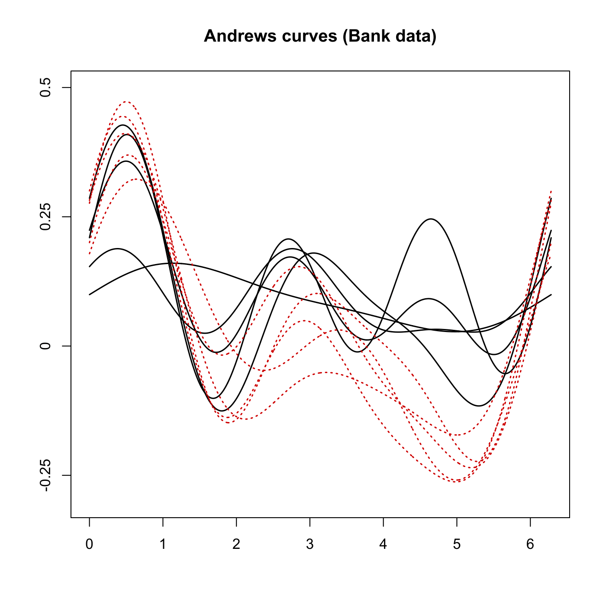
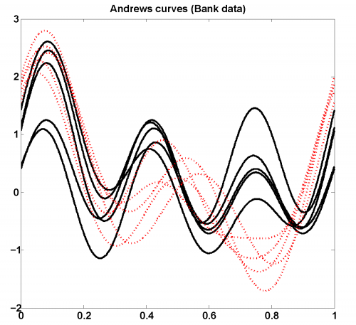

[](http://quantlet.de/)

## [](http://quantlet.de/) **MVAandcur2** [](http://quantlet.de/)

```yaml

Name of QuantLet: MVAandcur2

Published in: Applied Multivariate Statistical Analysis

Description: Computes Andrew''s Curves for the observations 96-105 of the Swiss bank notes data. The order of the variables is 6,5,4,3,2,1.

Keywords: Andrews curves, descriptive methods, normalization, scaling, financial, plot, graphical representation, data visualization

See also:  MVAandcur, MVAparcoo1

Author: Wolfgang K. Haerdle

Submitted: Tue, September 09 2014 by Awdesch Melzer
Submitted[Matlab]: Wed, November 16 2016 by Lily Medina

Datafiles: bank2.dat

```





### R Code
```r


# clear variables and close windows
rm(list = ls(all = TRUE))
graphics.off()

# install and load packages
libraries = c("tourr", "matlab")
lapply(libraries, function(x) if (!(x %in% installed.packages())) {
install.packages(x)
})
lapply(libraries, library, quietly = TRUE, character.only = TRUE)


# The data file should be located in the same folder as this Qlet

# load data
data = read.table("bank2.dat")

x = data[96:105, ]
y = NULL
i = 1

while (i <= 6) {
    z = (x[, i] - min(x[, i]))/(max(x[, i]) - min(x[, i]))
    y = cbind(y, z)
    i = i + 1
}

y = fliplr(y)  # change the order

Type = c(rep(1, 5), rep(2, 5))
f = as.integer(Type)
grid = seq(0, 2 * pi, length = 1000)

plot(grid, andrews(y[1, ])(grid), type = "l", lwd = 1.5, main = "Andrews curves (Bank data)", 
    axes = FALSE, frame = TRUE, ylim = c(-0.3, 0.5), ylab = "", xlab = "")
for (i in 2:5) {
    lines(grid, andrews(y[i, ])(grid), col = "black", lwd = 1.5)
}
for (i in 6:10) {
    lines(grid, andrews(y[i, ])(grid), col = "red3", lwd = 1.5, lty = "dotted")
}
axis(side = 2, at = seq(-0.5, 0.5, 0.25), labels = seq(-0.5, 0.5, 0.25))
axis(side = 1, at = seq(0, 7, 1), labels = seq(0, 7, 1))
```

automatically created on 2018-05-28

### MATLAB Code
```matlab

%% clear variables and close windows 
 clear
 clc 
 close all

 %% load data
 x = load('bank2.dat'); 
 z = x(96:105,:);                                      % extracts observations 96-105
 s = size(z);
 
 minz   = repmat(min(z),s(1,1),1);
 maxmin = repmat(max(z)-min(z),s(1,1),1);
 
 z1 = (z-minz)./(maxmin);                               % standardizes the data     
 z2 = z1(:,[6;5;4;3;2;1]); 
 
 zgen = z2(1:5,:);
 zcou = z2(6:10,:);
 
%% plot
 hold on
 andrewsplot(zgen,'LineWidth',1.5,'Color','k')      
 andrewsplot(zcou,'LineWidth',1.5,'Color','r','Linestyle',':')
 title('Andrews curves (Bank data)')
 hold off

```

automatically created on 2018-05-28