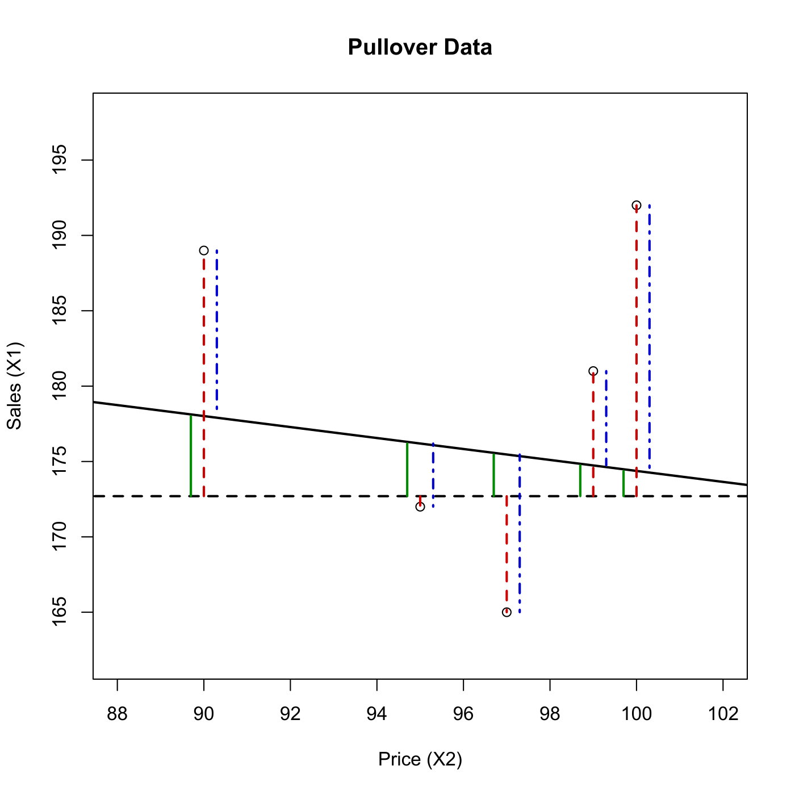
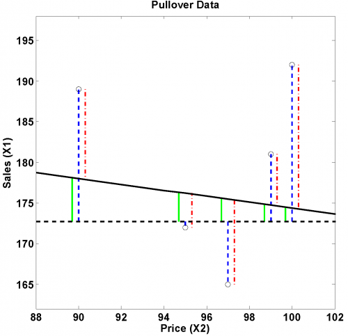
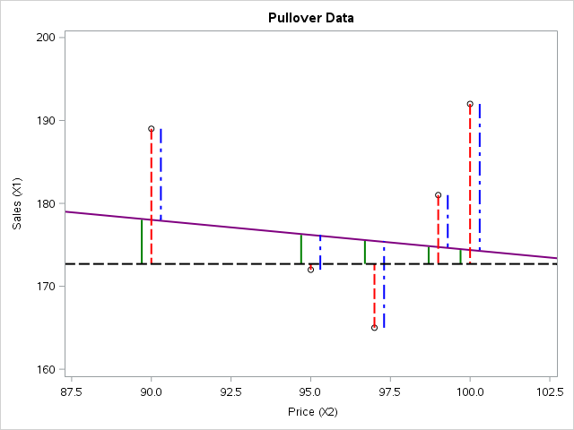

[](http://quantlet.de/)

## [](http://quantlet.de/) **MVAregzoom** [](http://quantlet.de/)

```yaml

Name of QuantLet: MVAregzoom

Published in: Applied Multivariate Statistical Analysis

Description: 'Plots a section of the linear regression of the sales (X1) on price (X2) for the pullovers data. Graphical representation of the relationship: total variation = explained variation + unexplained variation.'

Keywords: data visualization, graphical representation, plot, linear-model, linear-regression, regression, scatterplot, sas

See also: MVAregpull, MVAregbank

Author: Vladimir Georgescu, Jorge Patron, Song Song, Awdesch Melzer
Author[SAS]: Svetlana Bykovskaya

Submitted: Mon, September 15 2014 by Awdesch Melzer
Submitted[SAS]: Wen, April 6 2016 by Svetlana Bykovskaya
Submitted[Matlab]: Tue, November 22 2016 by Lily Medina

Datafiles: pullover.dat

```







### R Code
```r


# clear variables and close windows
rm(list = ls(all = TRUE))
graphics.off()

# load data
x   = read.table("pullover.dat")
dat = cbind(x[, 2], x[, 1])
cv  = cov(dat)
sxy = cv[2, 1]
sxx = cv[1, 1]

beta = sxy/sxx

alpha = mean(dat[, 2]) - beta * mean(dat[, 1])

y = dat[, 2]

yhat = alpha + beta * dat[, 1]

yquer = NULL
steps = dim(x)[1]
for (i in 1:steps) {
    yquer[i] = mean(dat[, 2])
}

# Generating line1
line11 = NULL
line12 = NULL
m = 1
for (i in 1:steps) {
    line11[m] = dat[i, 1]
    line11[m + 1] = dat[i, 1]
    line11[m + 2] = dat[i, 1]
    m = m + 3
}

m = 1
for (i in 1:steps) {
    line12[m] = yquer[i]
    line12[m + 1] = y[i]
    line12[m + 2] = yhat[i]
    m = m + 3
}

line1 = cbind(line11, line12)

# Generating line2
line21 = NULL
line22 = NULL
m = 1

for (i in 1:steps) {
    line21[m] = dat[i, 1] - 0.3
    line21[m + 1] = dat[i, 1] - 0.3
    line21[m + 2] = dat[i, 1] - 0.3
    m = m + 3
}

m = 1
for (i in 1:steps) {
    line22[m] = yquer[i]
    line22[m + 1] = y[i]
    line22[m + 2] = yhat[i]
    m = m + 3
}

line2 = cbind(line21, line22)

# Generating line3

line31 = NULL
line32 = NULL

m = 1
for (i in 1:steps) {
    line31[m] = dat[i, 1] + 0.3
    line31[m + 1] = dat[i, 1] + 0.3
    line31[m + 2] = dat[i, 1] + 0.3
    m = m + 3
}

m = 1
for (i in 1:steps) {
    line32[m] = yquer[i]
    line32[m + 1] = y[i]
    line32[m + 2] = yhat[i]
    m = m + 3
}

line3 = cbind(line31, line32)

t = (round(min(dat[, 1])) - 5):(round(max(dat[, 1])) + 5)
fit = alpha + beta * t

rl = cbind(t, fit)

aux = mean(dat[, 2]) * matrix(1, length(t), length(t))
aux1 = aux[, 1]
ybar = cbind(t, aux1)

# Chart
plot(dat[, 1], dat[, 2], xlab = "Price (X2)", ylab = "Sales (X1)", xlim = c(88, 
    102), ylim = c(162, 198))
title("Pullover Data")
lines(rl[, 1], rl[, 2], lwd = 2)
lines(ybar[, 1], ybar[, 2], lty = "dashed", lwd = 2)

# redline
redline = rbind(line1[1, ], line1[2, ], line1[4, ], line1[5, ], line1[7, ], line1[8, 
    ], line1[10, ], line1[11, ], line1[13, ], line1[14, ], line1[16, ], line1[17, 
    ], line1[19, ], line1[20, ], line1[22, ], line1[23, ], line1[25, ], line1[26, 
    ], line1[28, ], line1[29, ])

i = 1
s = dim(redline)[1]
while (i < s) {
    lines(c(redline[i, 1], redline[i + 1, 1]), c(redline[i, 2], redline[i + 
        1, 2]), col = "red3", lwd = 2, lty = "dashed")
    i = i + 2
}

# Greenline
greenline = rbind(line2[1, ], line2[3, ], line2[4, ], line2[6, ], line2[7, ], line2[9, 
    ], line2[10, ], line2[12, ], line2[13, ], line2[15, ], line2[16, ], line2[18, 
    ], line2[19, ], line2[21, ], line2[22, ], line2[24, ], line2[25, ], line2[27, 
    ], line2[28, ], line2[30, ])

i = 1
while (i < s) {
    lines(c(greenline[i, 1], greenline[i + 1, 1]), c(greenline[i, 2], greenline[i + 
        1, 2]), col = "green4", lwd = 2)
    i = i + 2
}

# blueline
blueline = rbind(line3[1, ], line3[3, ], line3[5, ], line3[6, ], line3[7, ], line3[8, 
    ], line3[7, ], line3[9, ], line3[10, ], line3[12, ], line3[13, ], line3[15, 
    ], line3[17, ], line3[18, ], line3[19, ], line3[20, ], line3[23, ], line3[24, 
    ], line3[27, ], line3[26, ], line3[27, ], line3[28, ], line3[29, ], line3[30, 
    ])

i = 1
while (i < s) {
    lines(c(blueline[i, 1], blueline[i + 1, 1]), c(blueline[i, 2], blueline[i + 1, 
        2]), col = "blue3", lwd = 2, lty = 4)
    i = i + 2
}

```

automatically created on 2018-05-28

### MATLAB Code
```matlab

%% clear all variables
clear
clc
close all

%% load data
x = load('pullover.dat');     

dat(:,1) = x(:,2); % extracts colum 2 
dat(:,2) = x(:,1); % extracts column 1

cv  = cov(dat); % compute var-cov matrix 
sxy = cv(2,1); % extracts covariance
sxx = cv(1,1); % extracts variance var 1

beta  = sxy/sxx;
alpha = mean(dat(:,2)) - beta*mean(dat(:,1));
y     = dat(:,2);
yhat  = alpha + beta * dat(:,1);


for i = 1:length(x)
    yquer(i) = mean(dat(:,2));
end

%% plot
% Generate line1
m = 1;
for i = 1:length(x)
        line1(m,1)   = dat(i,1);
        line1(m+1,1) = dat(i,1);
        line1(m+2,1) = dat(i,1);
        
        m = m+3;
end

m = 1;
for i = 1:length(x)
        line1(m,2)   = yquer(i);
        line1(m+1,2) = y(i);
        line1(m+2,2) = yhat(i);
        
        m = m+3;
end

%Generating line2
m = 1;
for i = 1:length(x)
        line2(m,1)   = dat(i,1)-0.3;
        line2(m+1,1) = dat(i,1)-0.3;
        line2(m+2,1) =dat(i,1)-0.3;
        m = m+3;
end

m = 1;
for i = 1:length(x)
        line2(m,2)   = yquer(i);
        line2(m+1,2) = y(i);
        line2(m+2,2) = yhat(i);
        
        m = m+3;
end

%Generating line3
m = 1;
for i = 1:length(x)
        line3(m,1)   = dat(i,1)+0.3;
        line3(m+1,1) = dat(i,1)+0.3;
        line3(m+2,1) = dat(i,1)+0.3;
        
        m = m+3;
end

m = 1;
for i = 1:length(x)
        line3(m,2)   = y(i);
        line3(m+1,2) = yhat(i);
        line3(m+2,2) = yquer(i);
        
        m = m+3;
end

t   = (round(min(dat(:,1)))-5):(round(max(dat(:,1))) +5);
fit = alpha + beta*t;

rl(:,1) = t;
rl(:,2) = fit;

aux  = mean(dat(:,2))*ones(length(t));
aux1 = aux(:,1);

ybar(:,1) = t;
ybar(:,2) = aux1;

hold on

%Blueline
blueline(1,:)  = line1(1,:);
blueline(2,:)  = line1(2,:);
blueline(3,:)  = line1(4,:);
blueline(4,:)  = line1(5,:);
blueline(5,:)  = line1(7,:);
blueline(6,:)  = line1(8,:);
blueline(7,:)  = line1(10,:);
blueline(8,:)  = line1(11,:);
blueline(9,:)  = line1(13,:);
blueline(10,:) = line1(14,:);
blueline(11,:) = line1(16,:);
blueline(12,:) = line1(17,:);
blueline(13,:) = line1(19,:);
blueline(14,:) = line1(20,:);
blueline(15,:) = line1(22,:);
blueline(16,:) = line1(23,:);
blueline(17,:) = line1(25,:);
blueline(18,:) = line1(26,:);
blueline(19,:) = line1(28,:);
blueline(20,:) = line1(29,:);

i = 1;
while i<length(blueline)
    line([blueline(i,1) blueline(i+1,1)],[blueline(i,2) blueline(i+1,2)],'Color','b','LineWidth',2,'LineStyle','--');
    i = i+2;
end

%Greenline
greenline(1,:)  = line2(1,:);
greenline(2,:)  = line2(3,:);
greenline(3,:)  = line2(4,:);
greenline(4,:)  = line2(6,:);
greenline(5,:)  = line2(7,:);
greenline(6,:)  = line2(9,:);
greenline(7,:)  = line2(10,:);
greenline(8,:)  = line2(12,:);
greenline(9,:)  = line2(13,:);
greenline(10,:) = line2(15,:);
greenline(11,:) = line2(16,:);
greenline(12,:) = line2(18,:);
greenline(13,:) = line2(19,:);
greenline(14,:) = line2(21,:);
greenline(15,:) = line2(22,:);
greenline(16,:) = line2(24,:);
greenline(17,:) = line2(25,:);
greenline(18,:) = line2(27,:);
greenline(19,:) = line2(28,:);
greenline(20,:) = line2(30,:);

i = 1;
while i<length(greenline)
    line([greenline(i,1) greenline(i+1,1)],[greenline(i,2) greenline(i+1,2)],'Color','g','LineWidth',2);
    i = i+2;
end

%Redline
redline(1,:)  = line3(1,:);
redline(2,:)  = line3(2,:);
redline(3,:)  = line3(4,:);
redline(4,:)  = line3(5,:);
redline(5,:)  = line3(7,:);
redline(6,:)  = line3(8,:);
redline(7,:)  = line3(10,:);
redline(8,:)  = line3(11,:);
redline(9,:)  = line3(13,:);
redline(10,:) = line3(14,:);
redline(11,:) = line3(16,:);
redline(12,:) = line3(17,:);
redline(13,:) = line3(19,:);
redline(14,:) = line3(20,:);
redline(15,:) = line3(22,:);
redline(16,:) = line3(23,:);
redline(17,:) = line3(25,:);
redline(18,:) = line3(26,:);
redline(19,:) = line3(28,:);
redline(20,:) = line3(29,:);

i = 1;
while i<length(redline)
    line([redline(i,1) redline(i+1,1)],[redline(i,2) redline(i+1,2)],'Color','r','LineWidth',2,'LineStyle','-.');
    i = i+2;
end

scatter(dat(:,1),dat(:,2),75,'k');
title('Pullover Data')
xlabel('Price (X2)')
ylabel('Sales (X1)')
xlim([88 102]);
ylim([162 198]);
line(rl(:,1),rl(:,2),'Color','k','LineWidth',2)
line(ybar(:,1),ybar(:,2),'Color','k','LineStyle','--','LineWidth',2)
hold off
```

automatically created on 2018-05-28

### SAS Code
```sas


* Import the data;
data pull;
  infile '/folders/myfolders/Sas-work/data/pullover.dat';
  input x1-x4; 
  drop x3 x4;
run;

proc means data = pull noprint;
  var x1;
  output out = testmean mean = xbar;
run;

data _null_;
  set testmean;
  call symput("mx1",xbar);
run;

%put mean of x is &mx1;

* calculating mean;
%put mean x1 = &mx1;

* regression of (X1) sales on (X2) price;
ods graphics off;
proc reg data = pull;
  model x1 = x2;
  ods output ParameterEstimates=PE;
run;

proc iml;
  * Read data into a matrix;
  use pull;
    read all var _ALL_ into x; 
  close pull;
  
  use PE;
    read all var _ALL_ into z; 
  close PE;
  
  alpha = z[1,2];
  beta  = z[2,2];

  * generating lines;
  y = j(2*nrow(x),7,0);
  do i = 1 to nrow(x);
    y[2*i-1,1] = x[i,1];
    y[2*i-1,2] = x[i,2];
    y[2*i-1,3] = x[i,1];
    y[2*i-1,5] = &mx1;
    y[2*i-1,7] = i;
    y[2*i,1] = &mx1;
    y[2*i,2] = x[i,2];
    y[2*i,3] = alpha + beta*x[i,2];
    y[2*i,5] = alpha + beta*x[i,2];
    y[2*i,7] = i;
  end;

  y[,4] = y[,2]+0.3;
  y[,6] = y[,2]-0.3;
  
  create lines from y[colname={"b1" "b2" "r1" "r2" "g1" "g2" "id"}];
    append from y;
  close lines;
quit;

data pull;
  merge pull lines;
run;

* regression of (X1) sales on (X2) price;
proc sgplot data = pull noautolegend;
   title "Pullover Data";
   reg y = x1 x = x2 / 
     lineattrs = (color = purple thickness = 2) 
     markerattrs = (color = black); 
   series y = b1 x = b2 / group = id 
     lineattrs = (color = red pattern = 4 thickness = 2);                   * red line;
   series y = r1 x = r2 / group = id 
     lineattrs = (color = blue pattern = MediumDashShortDash thickness = 2);  * blue line;
   series y = g1 x = g2 / group = id 
     lineattrs = (color = green thickness = 2);                              * green line;
   refline &mx1 / lineattrs = (color = black pattern = 4 thickness = 2);
   xaxis min = 88  max = 102 label = 'Price (X2)';
   yaxis min = 162 max = 198 label = 'Sales (X1)';
run;

```

automatically created on 2018-05-28