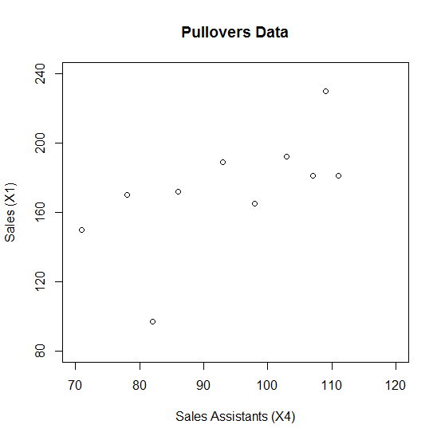
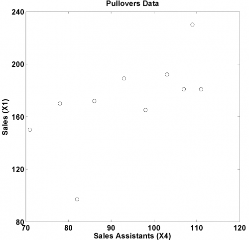
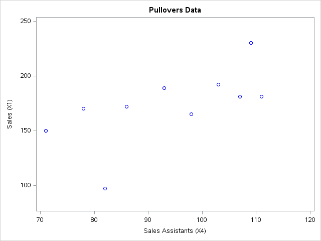

[](http://quantlet.de/)

## [](http://quantlet.de/) **MVAscapull2** [](http://quantlet.de/)

```yaml

IName of QuantLet: MVAscapull2

Published in: Applied Multivariate Statistical Analysis

Description: Computes a two dimensional scatterplot of assistants and sales from the pullovers data set.

Keywords: data visualization, graphical representation, scatterplot, financial, plot, sas

See also: MVAcorrnorm, MVAregbank, MVAregpull, MVAscabank45, MVAscabank56, MVAscabank456, MVAscacar, MVAscapull1, MVAdraftbank4, MVAdrafthousing, MVAdrafthousingt

Author: Jorge Patron, Vladimir Georgescu, Song Song, Awdesch Melzer
Author[SAS]: Svetlana Bykovskaya

Submitted: Mon, September 15 2014 by Awdesch Melzer
Submitted[SAS]: Wen, April 6 2016 by Svetlana Bykovskaya
Submitted[Matlab]: Tue, November 22 2016 by Lily Medina

Datafile: pullover.dat

```







### MATLAB Code
```matlab

%% clear all variables
clear all
close all
clc

%% load data
x = load('pullover.dat');

%% plot
scatter(x(:,4),x(:,1),75,'k')

title('Pullovers Data')
xlabel('Sales Assistants (X4)')
ylabel('Sales (X1)')
```

automatically created on 2018-05-28

### R Code
```r


# clear all variables
rm(list = ls(all = TRUE))
graphics.off()

# load data
x = read.table("pullover.dat")

# plot
plot(x[, 4], x[, 1], xlab = "Sales Assistants (X4)", ylab = "Sales (X1)", xlim = c(70, 
    120), ylim = c(80, 240), frame = TRUE, axes = FALSE)
title("Pullovers Data")
axis(side = 2, seq(80, 240, 40), seq(80, 240, 40))
axis(side = 1, seq(70, 130, 10), seq(70, 130, 10))

```

automatically created on 2018-05-28

### SAS Code
```sas


* Import the data;
data pull;
  infile '/folders/myfolders/Sas-work/data/pullover.dat';
  input x1-x4; 
run;

proc sgplot data = pull
    noautolegend;
  title 'Pullovers Data';
  scatter x = x4 y = x1 / markerattrs = (color = blue);
  xaxis min = 70 max = 120 label = 'Sales Assistants (X4)';
  yaxis min = 80 max = 240 label = 'Sales (X1)';
run;
```

automatically created on 2018-05-28