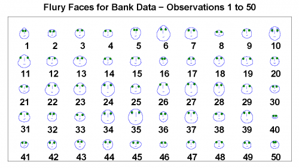
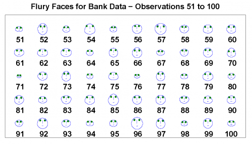
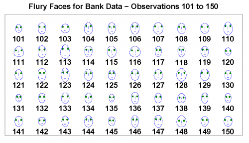
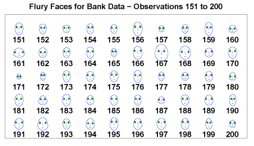
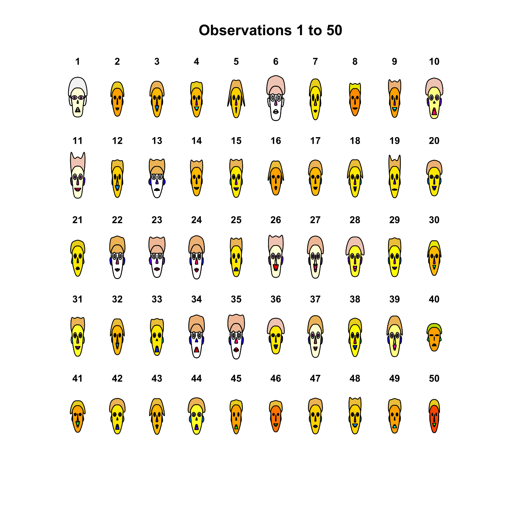
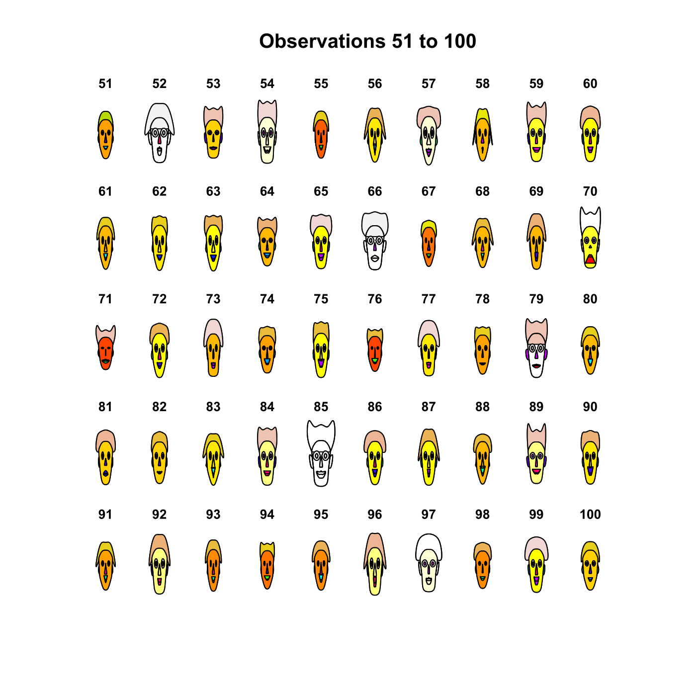
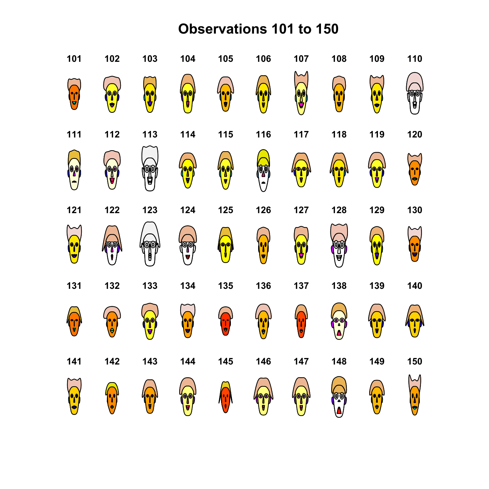
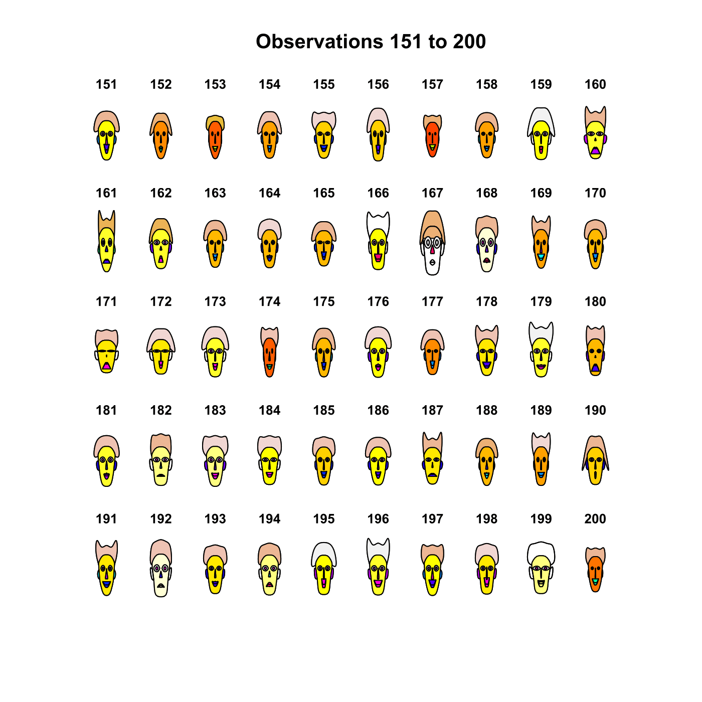

[](http://quantlet.de/)

## [](http://quantlet.de/) **MVAfacebank50** [](http://quantlet.de/)

```yaml

Name of QuantLet: MVAfacebank50

Published in: Applied Multivariate Statistical Analysis

Description: 'Computes Flury faces for the Swiss bank notes data.'

Keywords: Flury faces, financial, data visualization, graphical representation, plot

See also: MVAfacebank10

Author: Julia Wandke

Submitted: Tue, September 09 2014 by Awdesch 
Submitted[Matlab]: Mon, November 15 2016 Lily Medina

Datafiles: bank2.dat

```

















### R Code
```r


# clear variables and close windows
rm(list = ls(all = TRUE))
graphics.off()

# install and load packages
libraries = c("aplpack")
lapply(libraries, function(x) if (!(x %in% installed.packages())) {
install.packages(x)
})
lapply(libraries, library, quietly = TRUE, character.only = TRUE)

# load data
x  = read.table("bank2.dat")

ncolors = 15

# plot 1
x1 = x[1:50, ]
faces(x1, face.type = 1, scale = TRUE, col.nose = rainbow(ncolors), col.eyes = rainbow(ncolors, 
    start = 0.6, end = 0.85), col.hair = terrain.colors(ncolors), col.face = heat.colors(ncolors), 
    col.lips = rainbow(ncolors, start = 0, end = 1), col.ears = rainbow(ncolors, 
        start = 0, end = 0.8), plot.faces = TRUE, nrow.plot = 5, ncol.plot = 10, 
    main = "Observations 1 to 50")

# plot 2
dev.new()
x2 = x[51:100, ]
faces(x2, face.type = 1, scale = TRUE, col.nose = rainbow(ncolors), col.eyes = rainbow(ncolors, 
    start = 0.6, end = 0.85), col.hair = terrain.colors(ncolors), col.face = heat.colors(ncolors), 
    col.lips = rainbow(ncolors, start = 0, end = 1), col.ears = rainbow(ncolors, 
        start = 0, end = 0.8), plot.faces = TRUE, nrow.plot = 5, ncol.plot = 10, 
    main = "Observations 51 to 100")

# plot 3
dev.new()
x3 = x[101:150, ]
faces(x3, face.type = 1, scale = TRUE, col.nose = rainbow(ncolors), col.eyes = rainbow(ncolors, 
    start = 0.6, end = 0.85), col.hair = terrain.colors(ncolors), col.face = heat.colors(ncolors), 
    col.lips = rainbow(ncolors, start = 0, end = 1), col.ears = rainbow(ncolors, 
        start = 0, end = 0.8), plot.faces = TRUE, nrow.plot = 5, ncol.plot = 10, 
    main = "Observations 101 to 150")

# plot 4
dev.new()
x4 = x[151:200, ]
faces(x4, face.type = 1, scale = TRUE, col.nose = rainbow(ncolors), col.eyes = rainbow(ncolors, 
    start = 0.6, end = 0.85), col.hair = terrain.colors(ncolors), col.face = heat.colors(ncolors), 
    col.lips = rainbow(ncolors, start = 0, end = 1), col.ears = rainbow(ncolors, 
        start = 0, end = 0.8), plot.faces = TRUE, nrow.plot = 5, ncol.plot = 10, 
    main = "Observations 151 to 200")

```

automatically created on 2018-05-28

### MATLAB Code
```matlab

%% clear variables and close windows
close all
clear 
clc

%% load data
h = load('bank2.dat');    

%% plot
glyphplot(h, 'Glyph','face','Grid',[5 10],'Page','all')
title('Flury Faces for Bank Data');
   
```

automatically created on 2018-05-28